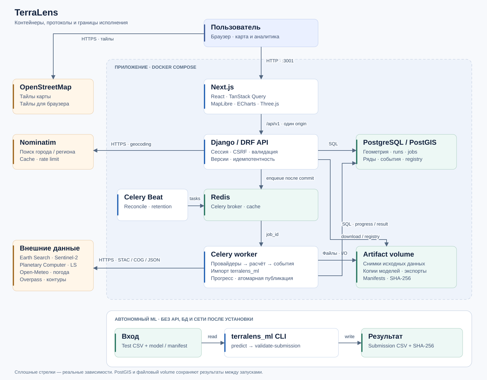

# TerraLens

**Спутниковая история поля: от контура на карте до восстановленного NDVI и проверяемого результата.**

[](https://github.com/ArtycoBW/Terralens/actions/workflows/backend-ml.yml)
[](https://github.com/ArtycoBW/Terralens/actions/workflows/frontend.yml)

TerraLens помогает изучить состояние сельскохозяйственной территории за выбранный период. Пользователь сохраняет контур, сервис собирает Sentinel-2, Landsat и погоду, восстанавливает пропуски NDVI и показывает отклонения от истории поля. Наблюдения, оценки модели и отсутствие данных различаются в интерфейсе и экспорте.

Решение подготовлено для кейса о мониторинге вегетационной динамики сельскохозяйственных территорий: восстановление пропусков NDVI и интерпретация негативных аномалий. В репозитории два проверяемых результата: **веб-приложение с реальным сбором данных** и **автономный ML-пакет с готовыми submission для двух предоставленных тестовых входов**. Для запуска готовой версии обучение не требуется.

[Проверка для жюри](docs/JURY_GUIDE.md) · [Сверка материалов и 15 критериев](docs/CASE_AUDIT.md) · [Архитектура](docs/ARCHITECTURE.md) · [Контракт API](docs/03_API_CONTRACT.md) · [Модель и эксперименты](ml/README.md) · [Результаты проверок](docs/VERIFICATION.md)

**Материалы для защиты:** [презентация, 15 слайдов](deliverables/presentation/TerraLens-defense.pptx), [сценарий выступления, демо и ответы](docs/DEFENSE_GUIDE.md), [три реальных поля с графиками и CSV](docs/analysis/field-cases/REPORT.md). Слайды содержат редактируемые таблицы, диаграммы и заметки докладчика. Пример из Воронежской области показывает негативное отклонение от истории, без заявления подтверждённого агрономического диагноза.

Проверка переноса модели выполнена на 40 наблюдаемых датах трёх полей. На одиночных масках модель уступила M0: RMSE **0,05322 против 0,03754**; на парах соседних дат средний результат лучше: **0,06677 против 0,07637**. Все ухудшения и ограничения опубликованы. Эта проверка не заменяет локальную оценку конкурсного submission и не доказывает одинаковую точность во всех регионах.

## Быстрый запуск

Нужны Git и Docker с Compose v2 и запущенным daemon. На Windows удобно использовать Docker Desktop в режиме Linux containers. Во время первой сборки и для нового спутникового анализа нужен интернет.

```sh
git clone https://github.com/ArtycoBW/Terralens.git
cd Terralens
docker compose up --build -d
docker compose ps
```

| Адрес | Что проверить |
|---|---|
| [localhost:3001](http://localhost:3001) | Лендинг и вход в приложение |
| [localhost:3001/app](http://localhost:3001/app) | Рабочая карта; гостевая сессия создаётся автоматически |
| [localhost:8000/api/v1/docs](http://localhost:8000/api/v1/docs) | Swagger с фактической схемой API |
| [localhost:8000/api/v1/health/ready](http://localhost:8000/api/v1/health/ready) | Готовность API, БД, Redis и зарегистрированной модели |

Compose запускает миграции и регистрирует включённую модель, затем поднимает API, worker, scheduler и frontend. Состояние `migrate: Exited (0)` ожидаемо. База и результаты сохраняются в Docker volumes между перезапусками.

Для локальной проверки `.env` не обязателен: действуют значения Compose. Параметры перечислены в [.env.example](.env.example). Порт frontend меняется через `FRONTEND_PORT`; по умолчанию заняты `3001`, `8000`, `54329`, `56379`, доступ только с этого компьютера. Для публичного размещения задайте свой секрет, разрешённые домены, HTTPS и secure cookies.

```sh
docker compose logs --tail=80 backend worker
# Остановить, сохранив данные
docker compose stop
# Возобновить работу
docker compose up -d
```

## Что попробовать за пять минут

1. Откройте карту. Найдите **Potsdam**, приблизьте территорию и выберите контур OSM либо нарисуйте собственный: минимум три вершины, затем клик по первой точке или Enter. Можно импортировать [готовый GeoJSON](backend/tests/fixtures/potsdam.geojson).
2. Сохраните поле. В его паспорте выберите **01–10 июня 2024** и запустите анализ. Сбор обращается к внешним сервисам и может занимать несколько минут; прошлые сезоны входят в общий прогресс.
3. Посмотрите NDVI, погоду, происхождение значений и раздел качества. `Частичные данные` — полноценный результат с перечисленными ограничениями, а не скрытая ошибка.
4. Запустите другой период или другое поле. В разделе сравнения выберите до четырёх завершённых анализов, переключите календарные даты и совмещение сезонов.
5. Скачайте CSV, GeoJSON или JSON и manifest. В разделе **Бенчмарк** проверьте готовые прогнозы на предоставленном наборе, а в **Модели** — версию и метрики.

[Подробный маршрут жюри, пограничные случаи и команды воспроизведения](docs/JURY_GUIDE.md).

## Возможности приложения

| Задача | Реализация |
|---|---|
| Найти и сохранить поле | Nominatim, контуры Overpass, рисование, GeoJSON, редактирование, версии геометрии и история культур |
| Собрать наблюдения | Реальные STAC/COG Sentinel-2 и Landsat, маски облаков и качества, агрегация по контуру |
| Восстановить NDVI | Общий Python runtime для worker и автономного CLI, ансамбль CatBoost, явное происхождение оценок |
| Дать контекст | Погода, предыдущие сезоны, сезонная норма, интервалы прогноза и предупреждения |
| Найти отклонения | Периоды снижения, степень уверенности, доступные подтверждения и рекомендации для проверки |
| Сопоставить результат | До четырёх анализов, календарное/сезонное выравнивание, дневные ряды и качество |
| Проверить и выгрузить | CSV / GeoJSON / JSON, manifests, SHA-256, snapshots источников, реестр моделей |
| Управлять вычислениями | Фоновые задачи, общий прогресс, отмена, явный повтор, защита от повторного запуска |

## Архитектура



Frontend обращается к API через Next.js под одним origin. Django хранит геометрию, версии и задания в PostGIS; Celery исполняет сбор и расчёт в фоне через Redis. Worker импортирует `terralens_ml` и сохраняет результат атомарно. Снимки источников, копии моделей и экспорты лежат в общем файловом volume. Scheduler восстанавливает доставку заданий и обслуживает срок хранения.

ML — самостоятельный Python-пакет, используемый также через CLI. Отдельного ML HTTP-сервиса в приложении нет. [Границы компонентов, последовательность анализа, сущности и поток обучения](docs/ARCHITECTURE.md).

| Уровень | Технологии |
|---|---|
| Интерфейс | Next.js 16, React 19, TypeScript, Tailwind CSS 4, shadcn/Radix, TanStack Query |
| Карта и визуализация | MapLibre GL, Terra Draw, ECharts; Three.js, GSAP и Lenis на лендинге |
| API и геоданные | Python 3.12, Django 5.2 LTS, GeoDjango, Django REST Framework, PostgreSQL 16 / PostGIS 3.5 |
| Задания | Celery, Redis 7.4, Celery Beat |
| Вычисления | pandas, NumPy, SciPy, scikit-learn, CatBoost, rasterio, Shapely |
| Воспроизводимость | Docker Compose, uv.lock, requirements.lock, pnpm-lock.yaml, GitHub Actions |

## Данные и качество модели

| Набор | Строк | Полигонов | Целевые значения |
|---|---:|---:|---:|
| `train_dataset.csv` в `train-dataset.zip` | 99 955 | 39 | 30 520 известных |
| `test-dataset.csv` | 57 185 | 78 | 3 112 контрольных пропусков |
| `test_features.csv` в `doc-1788600393.zip` | 49 190 | 20 | 2 323 контрольных пропуска |
| `private_test_ground_truth.csv` в `doc-1788600416.zip` | 3 112 | 78 | Ответы только для `test-dataset.csv` |

Источники: [исходный профиль данных](docs/analysis/dataset-profile.json), [проверки данных](docs/analysis/dataset-checks.json), [сверка всех вложений и SHA-256](docs/analysis/input-review/materials.json). `doc-1788536686.zip` — побайтовая копия `train-dataset.zip`. В постановке тест назван `private_features.csv`; в полученных материалах два разных входа. Их контрольные ключи не пересекаются, указания о выборе финального набора не получены.

Готовы [submission на 3 112 точек](deliverables/submission.csv) и [отдельный submission на 2 323 точки](deliverables/submission-test-features.csv), каждый со своим manifest. Архивы нового входа и ответов в Git не добавлены. Ответы использованы только для локальной оценки ранее опубликованной модели. CSV не содержит геометрий: анонимные benchmark-полигоны не размещаются на карте по выдуманным координатам.

Опубликованная модель **`131aee618934151e`** — среднее трёх CatBoost residual моделей: seeds 42/107/211, по 400 деревьев глубины 5, 78 признаков календаря, локального контекста и динамики сенсоров. Погода не входит в признаки выбранной модели. Пригодные наблюдения сохраняются, корректируются только пропуски.

| Проверка | N | Предыдущая модель, RMSE ↓ | Текущая модель, RMSE ↓ |
|---|---:|---:|---:|
| Development: отдельные точки | 4 482 | 0,069207 | **0,068260** |
| Development: блоки пропусков | 4 430 | 0,095374 | **0,094173** |
| Повторная assessment: точки | 511 | 0,072679 | **0,071194** |
| Повторная assessment: блоки | 514 | **0,090523** | 0,092206 |
| Temporal 2024: точки | 282 | 0,057872 | **0,057633** |
| Temporal 2024: блоки | 286 | **0,078942** | 0,080936 |

Development: 21 selection AOI до 2024 года, пять GroupKFold; отдельные пять AOI для калибровки и пять для assessment. Скрытые цели и динамические значения исключаются до построения признаков. Итог обучен на 79 256 примерах, покрывающих 14 977 пригодных целей selection.

**Локальная оценка готового submission по приложенным ответам:** RMSE **0,075034**, MAE **0,049410**, GapScore **7,49 / 30** на 3 112 точках. Ключи совпали полностью; модель и прогнозы зафиксированы до чтения ответов и не менялись. Это не результат платформы организаторов. Для второго входа на 2 323 точки подходящих ответов нет. [Протокол сверки и команда оценки](docs/CASE_AUDIT.md#2-новая-локальная-оценка), [точные метрики и хеши](docs/analysis/input-review/local-score.json).

**Официальный test RMSE неизвестен.** Assessment и temporal уже просматривались: это повторная диагностика, не новый слепой тест. Текущая модель улучшила точки, но ухудшила блоки на assessment и temporal. Покрытие номинального 90% интервала на повторной assessment — 90,80% для точек и 90,08% для блоков; перенос этих значений на новые поля не подтверждён. [Полный протокол, все четыре кандидата и компромиссы](docs/analysis/crop-dynamics/REPORT.md).

## Воспроизвести submission

После сборки Docker достаточно двух команд; API, БД и Redis для этого запуска не нужны:

```sh
docker compose run --rm --no-deps batch predict --input test-dataset.csv --output artifacts/submission-check.csv --model ml/artifacts/final/manifest.json
docker compose run --rm --no-deps batch validate-submission --input test-dataset.csv --submission artifacts/submission-check.csv
```

Ожидается 3 112 строк, колонки `anon_polygon_id,date,primary_ndvi_pred` и SHA-256:

```text
0fd8aebc5297d2e57d9244ca71e401660ac309d4cc2a1a0b2d595963530c02e1
```

На Windows: `Get-FileHash artifacts/submission-check.csv -Algorithm SHA256`; на Linux/macOS: `shasum -a 256 artifacts/submission-check.csv`. [Manifest поставки](deliverables/submission.csv.manifest.json) и [проверка автономности](docs/analysis/crop-dynamics/offline_evidence.json).

Для `test_features.csv` из второго архива подготовлены [отдельные команды с подключением исходного ZIP](docs/CASE_AUDIT.md#3-отдельный-результат-для-test_featurescsv). Ожидается 2 323 строки. Наборы и их выходы нельзя объединять; валидатор сверяет ключи с конкретным входом.

Вариант без Docker, Python 3.12:

```sh
python -m venv .venv-ml
# Linux/macOS
.venv-ml/bin/pip install -c requirements.lock ./ml
.venv-ml/bin/python -m terralens_ml predict --input test-dataset.csv --output artifacts/submission-check.csv --model ml/artifacts/final/manifest.json
# Windows: заменить .venv-ml/bin/ на .venv-ml/Scripts/
```

После установки зависимостей инференс работает без сети. [Команды обучения и исследования](ml/README.md).

## Проверки и разработка

[Отчёт проверки текущей версии](docs/VERIFICATION.md) разделяет автоматические тесты, проверки живых источников и исторические эксперименты. CI запускает Python/API/ML, проверяет OpenAPI, миграции, воспроизводимость submission и автономность ML; frontend проходит типы, lint, unit, production build и браузерные сценарии.

```sh
# Python workspace: Python 3.12 + uv, на Linux нужны GEOS/GDAL/PROJ
uv sync --frozen
uv run --frozen ruff check ml backend scripts
uv run --frozen pytest -q
uv run --frozen python scripts/api_smoke.py
# Frontend: Node.js 24, pnpm 11.8.0; команды из frontend/
cd frontend
pnpm install --frozen-lockfile
pnpm typecheck
pnpm lint
pnpm test
pnpm build
pnpm test:e2e
```

Python-тестам нужны запущенные PostGIS/Redis (`docker compose up -d postgres redis`), они используют отдельную тестовую БД. Локально Playwright использует установленный Google Chrome; приложение должно работать на `localhost:3001`. CI запускает Chromium. Windows backend удобнее проверять в Linux-контейнере: нативному GeoDjango требуются отдельные DLL. [Backend](backend/README.md) · [Frontend](frontend/README.md) · [Правила вклада](CONTRIBUTING.md).

## Ограничения и происхождение данных

- Анализ ретроспективный: восстановление может использовать наблюдения по обе стороны пропуска. Это не прогноз будущего урожая.
- Низкое покрытие, облачность, неизвестная история культур, отсутствие трёх сопоставимых сезонов или отказ источника явно отражаются в результате. Аномалия — повод для проверки, а не доказанная причина ущерба.
- Погода взята из Open-Meteo ERA5-Seamless в центре поля: температура ERA5-Land, осадки ERA5. Это сеточные данные, а не датчик на участке. Источники NDVI — Earth Search Sentinel-2 C1 L2A и Planetary Computer Landsat 8/9 C2 L2.
- OSM не содержит всех полей. Гостевое пространство хранится семь дней, экспорт — один день. Лимиты по умолчанию: 20 полей, 10 000 га на контур, 5 000 вершин, период до 366 дней, три активные задачи; актуальные значения отдаёт `/capabilities`.
- Доступность и скорость нового сбора зависят от внешних провайдеров. [Три реальных поля, включая Россию](docs/analysis/field-cases/REPORT.md), проверены с одинаковыми масками; это не глобальная оценка точности. Ограничения числа сцен и отказы источников сохранены.
- Негативный период в Воронежской области подтверждён наблюдаемым отклонением от истории, но его агрономическая причина не размечена. Подготовлены презентация и сценарий защиты; [аудит](docs/CASE_AUDIT.md#6-комплект-защиты-и-внешние-условия) отделяет реализацию от экспертной оценки и организационных вопросов.
- Иллюстрации лендинга сгенерированы, рельеф демонстрационный. Они не выдаются за измерения выбранного поля. Атрибуция карты и лицензии компонентов сохранены в [реестре источников](docs/ATTRIBUTION.md).

## Структура репозитория

```text
backend/          API, модели БД, провайдеры, фоновые задачи и тесты
frontend/         Next.js, карта, аналитика, лендинг и браузерные тесты
ml/               автономный пакет, конфигурации, артефакты модели и тесты
docs/             архитектура, API, сценарии проверки и научные отчёты
deliverables/     два submission, manifests и презентация для защиты
scripts/          аудит данных, live smoke, проверка автономности
compose.yml       локальный запуск всего приложения
train-dataset.zip исходный обучающий набор
test-dataset.csv  исходный контрольный набор
```

Авторы изменений указаны в [истории проекта](https://github.com/ArtycoBW/Terralens/commits/main/). Результаты экспериментов сопровождаются конфигурациями, метриками и контрольными суммами; артефакты опубликованной модели используются одновременно в приложении и batch-инференсе.
