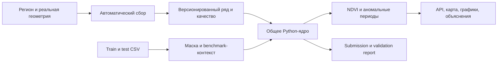

# Продукт, объём и матрица приёмки

Для изменений действует [единый формат коммитов](../CONTRIBUTING.md): `type(scope): описание на русском`.

## 1. Позиционирование

TerraLens помогает агроному/аналитику понять динамику растительности поля: что наблюдал спутник, что восстановил алгоритм, насколько ситуация отличается от обычного сезона и какие данные поддерживают возможное объяснение.

Пользователи: агроном (состояние и подозрительные периоды), аналитик (сравнение источников/сезонов), эксперт хакатона (проверка воспроизводимости и исследования). Технический оператор управляет конфигурациями/моделями через CLI/админку; панель сложного MLOps для обычного пользователя не нужна.

Обещаемые действия: выбрать территорию, получить данные, восстановить NDVI, сравнить с нормой, увидеть обоснованные кандидаты аномалий. Без доказательств не обещать диагноз болезни, оценку урожайности, автоматическое назначение агромероприятий или точные потери в деньгах.

## 2. Два сценария как единый продукт

Реальные геометрии и анонимные CSV — разные входы. Общее ядро обеспечивает одинаковый смысл реконструкции. Реальный сбор демонстрируется новым полигоном; batch оценивается по скрытым целям. Демо-кеш — резерв демонстрации с датой snapshot, не подмена нового сбора.

## 3. Приоритеты

**P0 — полный минимальный продукт и корректная оценка.** Две точки запуска, baseline, контроль утечек, submission validator, настоящая карта с выбором/рисованием, автоматический сбор спутника и погоды, исходный/восстановленный ряд, негативные периоды и базовые объяснения, сохранение run, обработка ошибок, README/Docker.

**P1 — целевой комплект для максимального покрытия критериев.** Несколько источников, перенос на два региона, управление набором полей, устойчивость к недоступным данным, дополнительные модели и абляции, интервалы с валидацией, сравнение сезонов, quality/provenance UI, экспорт, подтверждённые кейсы, отчёт/презентация. Минимальная страница Ascend и согласованная визуальная система.

**P2 — полезное превышение базовых требований.** Выбирать после закрытия P0/P1: приоритизация проверки полей по силе сигнала и уверенности, календарь доступности данных, сравнение методов на одном gap, аннотации агронома, экспорт отчёта, мониторинг обновлений, расширенный лендинг, снимок «до/после», модельные what-if сценарии с отдельной маркировкой.

**P3 — после хакатонной версии.** SSO/командные роли/платежи, LLM-чат, крупные deep-learning модели, прогноз урожайности, болезни/вредители, SAR/Sentinel-1, масштабная сегментация полей, real-time push, полноценная мобильная/offline-sync система. Добавлять только при данных, времени и измеренной пользе.

P0/P1 — порядок выполнения, а не разрешение игнорировать экспертные критерии P1. «Максимум возможного» означает сначала доказуемую полноту и качество, затем расширения с понятной ценностью.

## 4. Матрица всех критериев

Источник: `критекрии_приёмки.pdf`, страницы 2–5. Суммарный максимум: 100.

| ID | Критерий | Баллы | Что сделать | Доказательство |
|---|---|---:|---|---|
| AC-01 | Значение метрики | 30 | сильный reconstruction, leakage-safe validation, правильный submission | файл, hashes, official RMSE/GapScore после реальной оценки |
| AC-02 | Ясность презентации | 5 | читаемые слайды, единый стиль, понятные схемы | финальный deck, проверка на экране защиты |
| AC-03 | Выступление | 5 | подготовить ответы и распределить роли | репетиция, Q&A по модели/источникам/ограничениям |
| AC-04 | Демонстрация решения | 5 | полностью пройти основной путь | живое демо, резервные snapshot, сценарий |
| AC-05 | Детекция аномалий | 7 | негативные периоды, контекст, нетривиальные случаи | 2–3 разобранных ряда и пограничные проверки |
| AC-06 | Управление полигонами | 5 | добавлять/удалять/рисовать, находить контуры новых регионов | E2E + live discovery |
| AC-07 | Автоматический сбор и подготовка | 5 | спутник+погода, несколько источников, partial failures | новый полигон без CSV, provenance, отказ одного API |
| AC-08 | Адаптивность к регионам | 5 | отсутствие хардкода региона, unseen AOI validation | минимум 2 live-региона + grouped validation |
| AC-09 | Дополнительные технические/ML идеи | 5 | uncertainty, quality-aware restoration, ablations | измерение эффекта, примеры полезности |
| AC-10 | Baseline и отправная точка | 5 | описать M0, недостатки и гипотезы | baseline report и сравнение на тех же масках |
| AC-11 | Эксперименты и сравнения | 5 | таблица вариантов, seeds/folds, абляции | reproducible metrics.csv, manifests, выводы |
| AC-12 | Код и комментарии | 3 | понятные модули, русские комментарии сложных мест | repository review, lint/type checks |
| AC-13 | Документация/запуск | 5 | README, lock, обучение, API setup, Docker, batch | независимый clean-start smoke |
| AC-14 | Удобство использования | 5 | карта, график, понятный путь и состояния | UX/E2E/accessibility, реальные screenshots |
| AC-15 | Дополнительная продуктовая ценность | 5 | сравнение полей/сезонов, экспорт, приоритет проверок | законченный дополнительный пользовательский путь |

Техническое расширение AC-09 и продуктовая ценность AC-15 близки, но доказательства разные: для первого — качество/устойчивость алгоритма, для второго — полезный завершённый сценарий пользователя. Наличие одной красивой кнопки не гарантирует оба балла.

## 5. Предлагаемые расширения с оценкой пользы

| Идея | Польза | Зависимости | Приоритет/ограничение |
|---|---|---|---|
| Уверенность + доля наблюдений | не принимать длинную интерполяцию за факт | calibration/evidence | P1, особенно полезно для AC-05/09 |
| Quality calendar по источникам | объясняет пропуски и сбои | provenance | P1 |
| Сравнение полей/сезонов | позволяет оценить локальный или общий сигнал | несколько runs | P1 |
| Список «проверить в первую очередь» | меньше времени на разбор полей | severity+confidence, без выдуманных потерь | P2 |
| Baseline/model switch в лаборатории | наглядно показывает, что улучшили | сохранённые эксперименты | P2 |
| Аннотация агронома | обратная связь и история проверки | workspace persistence | P2, не дообучать автоматически |
| Снимок до/после | визуальная проверка растительности/облачности | imagery thumbnails | P2, реальные даты и источник |
| Change log свежих наблюдений | полезный регулярный мониторинг | scheduler/versioning | P2 |
| Прогноз NDVI | взгляд вперёд | causal validation и погодный forecast | P3, отдельная задача |
| LLM-объяснение | удобная формулировка | structured evidence | P3, базовое объяснение без него |
| Автоматическая культура/сегментация | богатый региональный поиск | разметка/модели/проверка | P3 |

## 6. Общие критерии завершения

Продукт считается готовым к сдаче, когда работают оба запуска, current test даёт 3 112 предсказаний, результаты воспроизводимы, основной интерфейс получает реальные API-данные, есть live-сбор нового поля, documented частичный отказ, эксперименты и выводы, артефакты/weights доступны проверяющим, подготовлены отчёт и презентация. Развернутый лендинг без этого не является завершением кейса.
