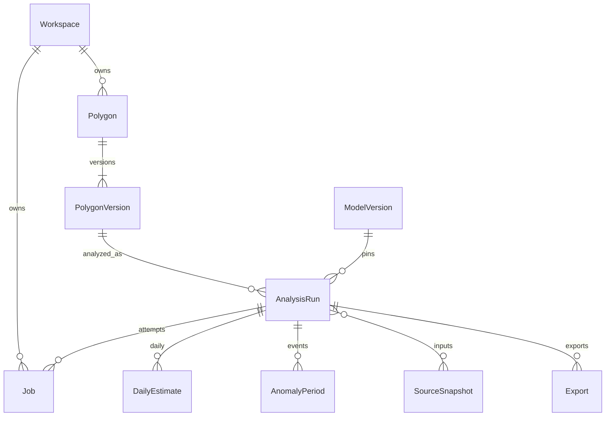
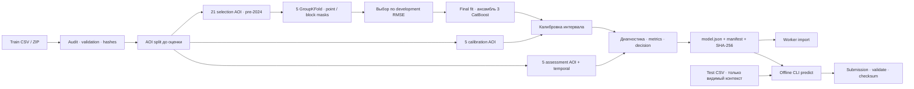

# Архитектура TerraLens

Документ описывает работающий код и локальное развёртывание. Уровень детализации — контекст системы, контейнеры, последовательность анализа и модель данных. Редактируемые диаграммы — в [architecture/](architecture/).

## Контекст и контейнеры


Пользователь работает с Next.js. Браузер получает тайлы OSM напрямую; бизнес-запросы `/api/v1` проходят через Next.js к Django под одним origin. Сессия HttpOnly и CSRF защищают изменения; данные ограничены гостевым workspace.

| Компонент | Ответственность | Реализация |
|---|---|---|
| Web | Маршруты, формы, карта, polling, графики, сравнение, экспорт | `frontend/src/app`, `frontend/src/components`, `frontend/next.config.ts` |
| API | Валидация, права доступа, версии геометрии, идемпотентность, чтение результатов | `backend/apps/core`, `backend/services/jobs.py` |
| Worker | Получение исходных данных, восстановление, события, публикация результатов и экспорт | `backend/apps/core/tasks.py`, `backend/services/analysis.py` |
| Scheduler | Повторная доставка queued jobs, поиск потерянных workers, retention | `backend/config/celery.py`, `backend/services/retention.py` |
| PostGIS | Источник истины для workspace, геометрий, runs, jobs, результатов и registry | `backend/apps/core/models.py`, миграции |
| Redis | Broker Celery, cache и общий rate limit поиска | Настройки Celery и `backend/providers/osm.py` |
| Artifact storage | Снимки источников, неизменяемые копии моделей, экспорты с manifests | Общий volume `artifacts-data`, `ARTIFACT_ROOT` |
| ML package | Единый алгоритм для веб-расчёта и автономного batch | `ml/src/terralens_ml` |
| Batch CLI | Проверка данных, обучение, инференс, валидация submission | `python -m terralens_ml`, профиль Compose `batch` |

Это модульное приложение с фоновыми workers. API и worker собираются из одного Python-образа, ML импортируется как пакет. В Compose нет Kubernetes, отдельного ML API, облачного object storage или потокового брокера.

## Последовательность анализа

```mermaid
sequenceDiagram
    autonumber
    actor User as Пользователь
    participant Web as Next.js / браузер
    participant API as Django API
    participant DB as PostGIS
    participant Queue as Redis / Celery
    participant Worker as Worker + ML
    participant Sources as STAC / COG / Weather
    participant Files as Artifact storage
    User->>Web: Контур + период + источники
    Web->>API: POST /analyses · CSRF + Idempotency-Key
    API->>DB: Транзакция: immutable config + AnalysisRun + Job
    DB-->>API: run_id + job_id
    API->>Queue: Доставка после commit
    API-->>Web: 202 Accepted
    Queue->>Worker: execute_job(job_id)
    Worker->>DB: Атомарно забрать queued job
    loop Каждый спутник и прошлый сезон
        Worker->>DB: Найти подходящий SourceSnapshot
        alt Валидный cache snapshot
            Worker->>Files: Прочитать и проверить checksum
        else Новые данные
            Worker->>Sources: STAC search + COG windows по полигону
            Sources-->>Worker: Наблюдения + QA + metadata
            Worker->>Files: Сохранить snapshot + SHA-256
        end
        Worker->>DB: Общий progress + heartbeat; проверить отмену
    end
    Worker->>Sources: Погода в центре поля
    Worker->>Worker: ML → ежедневный ряд → норма → события
    Worker->>DB: Транзакция: точки + события + summary + terminal state
    loop Пока выполняется
        Web->>API: GET /jobs/{id}, GET /analyses/{id}
        API-->>Web: Состояние и общий progress
    end
    Web->>API: GET /series, /anomalies, /quality
    API-->>Web: Опубликованный результат и происхождение данных
    Web-->>User: Графики, ограничения, экспорт
```

**Граница атомарности.** Сначала фиксируются параметры и задание, затем оно доставляется в очередь. Повторная доставка безопасна: `execute_job` блокирует строку и исполняет только `queued`. Если отправка в broker не состоялась, scheduler повторяет доставку. Сохранение дневных точек, аномалий, summary и успешного состояния выполняется одной транзакцией; отменённый job не публикует частично записанный результат.

**Прогресс.** Это доля общего плана, а не оставшегося времени. Все спутники и предыдущие сезоны занимают 0–80%, погода — до 90%, расчёт — до 97%; без погоды спутниковая часть занимает до 90%. 100% выставляется при сохранении результата. Переход к другому сезону, кеш и пустые ответы не сбрасывают шкалу. UI отдельно называет этап исторических наблюдений.

**Ошибки.** Отказ отдельного источника может дать `partial`; отсутствие пригодных наблюдений — `no_data`. Это успешное выполнение job с явно ограниченным содержимым run. Ошибка вычисления даёт `failed`, отмена — `cancelled`. Повтор создаёт связанный job; API не объявляет `succeeded` синонимом полного покрытия данными. Worker пишет heartbeat, scheduler выявляет потерянные задачи.

## Данные и воспроизводимость



- Изменение геометрии создаёт `PolygonVersion`. Запуск фиксирует версию, период, источники, параметры, культуру/сезоны и модель. Старые результаты не подменяются при редактировании поля.
- Registry копирует модель в каталог по hash manifest. Worker проверяет артефакт; обновление активной модели не меняет модель старого run.
- `SourceSnapshot` хранит query/geometry/config hashes, дату получения, checksum, метаданные QA и ссылку на JSON в volume. Кеш ограничен workspace и действителен сутки; `refresh_sources` запрашивает новый снимок.
- Каждый экспорт относится к зафиксированному результату и сопровождается manifest и SHA-256. Истёкший файл не выдаётся как доступный.
- Тренировочный `git_revision` в старых manifests — исходное происхождение артефакта на момент обучения. Самодостаточность модели проверяется hashes файлов и версией runtime; manifests не редактируются ради косметических изменений истории Git.

## Источники и вычислительная граница

| Источник | Обработка | Что сохраняется |
|---|---|---|
| Earth Search, Sentinel-2 C1 L2A | STAC, COG по геометрии, SCL, scale/offset, медиана пригодных пикселей | Даты, индексы, покрытие, исключения, provenance |
| Planetary Computer, Landsat 8/9 C2 L2 | QA_PIXEL/QA_RADSAT, scale/offset до индексов, маска полигона | Те же поля; временные SAS-подписи не сохраняются |
| Open-Meteo ERA5-Seamless | Суточные температура и осадки, UTC, центр поля | °C, мм, provenance и предупреждения |
| Nominatim / Overpass | Поиск региона, farmland ways/relations, валидация Polygon/MultiPolygon | Источник кандидата и проверяемая геометрия |

Расчёт в worker: QA → дневные наблюдения → восстановление NDVI → историческая норма по сопоставимым сезонам → отклонения и объяснения. Интервал прогноза и разброс сезонной нормы — разные величины. Погодный контекст используется в анализе; выбранный batch-ансамбль не обучен на погодных признаках.

## Обучение и автономный инференс



Маскирование выполняется до построения признаков, а соседи не пересекают AOI, сезон и непрерывный отрезок одной культуры. Ретроспективное восстановление использует видимые значения с обеих сторон пропуска. Assessment/temporal уже просматривались и не являются новым слепым подтверждением. [Протокол последнего эксперимента](analysis/crop-dynamics/PROTOCOL.md), [метрики и ограничения](analysis/crop-dynamics/REPORT.md).

## Развёртывание и эксплуатационные границы

Источник конфигурации — [compose.yml](../compose.yml). Внутри сети Compose frontend обращается к `backend:8000`, API/worker — к `postgres:5432` и `redis:6379`. Снаружи доступны только loopback-порты. `migrate` — одноразовая стартовая задача, не постоянно работающий сервис.

PostGIS и artifact volume требуют согласованного резервного копирования. Redis не является источником истины о run/job. Гостевой срок хранения и лимиты задаются конфигурацией, а UI получает их из `/capabilities`. Ошибки запросов содержат request ID, фоновые ошибки — job/run ID.

Два Celery процесса в локальном worker — текущая конфигурация, не обещание нагрузки. Масштабирование требует измерений провайдерских лимитов, ресурсов растрового чтения, БД и общего хранилища. Публичному развёртыванию нужны TLS/reverse proxy, секреты, политика доступа и настроенные резервные копии; это не компоненты локального demo.
