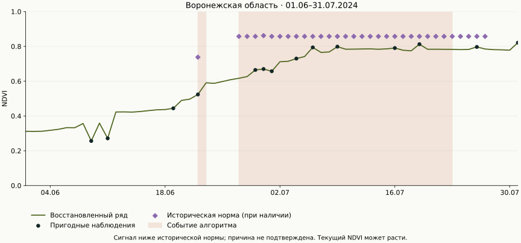
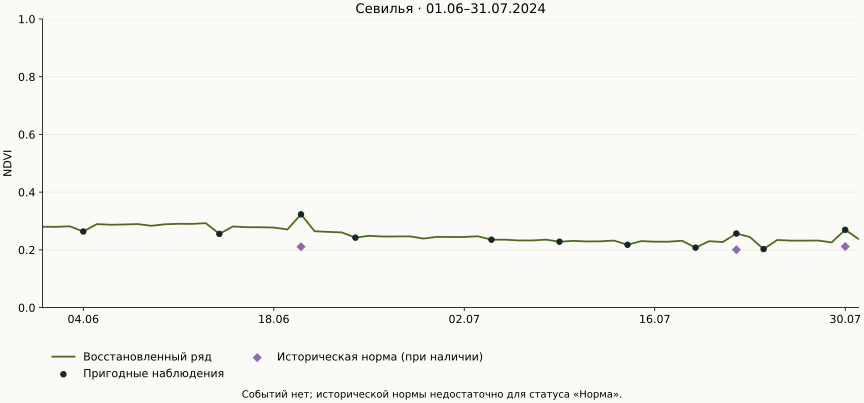
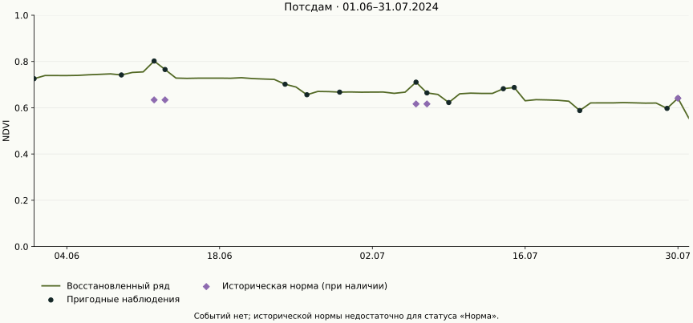

# Проверка на трёх реальных полях

**Сбор 5 сентября 2026 года; анализ 1 июня — 31 июля 2024 года.** Проверены Потсдам, Севилья и Воронежская область. Веса модели `131aee618934151e` и правила выбора полей зафиксированы до оценки. Нового обучения и подбора параметров не было. [Протокол](PROTOCOL.md), [полные метрики](summary.json), [проверка без сети](replay.json).

На отдельных скрытых датах итоговая модель в среднем **уступила M0**: RMSE 0,05322 против 0,03754. На парах соседних наблюдаемых дат средний результат лучше: 0,06677 против 0,07637. В Воронежской области модель уступила M0 в обоих сценариях. Эти результаты опубликованы полностью; они не дают оснований обещать одинаковую точность во всех регионах.

## Источники и границы проверки

| Поле | Сцен текущего периода / пригодных | Исторических сцен / пригодных | Наблюдаемых дней из 61 | Дней с доступным z-score | Итог |
|---|---:|---:|---:|---:|---|
| Потсдам | 70 / 28 | 216 / 76 | 15 | 4 | Недостаточно данных |
| Севилья | 33 / 21 | 96 / 77 | 11 | 3 | Недостаточно данных |
| Воронежская область | 87 / 46 | 191 / 111 | 14 | 27 | Критическое отклонение |

Собрано **693 спутниковые записи**, 359 прошли проверку пригодности. Несколько сцен/сенсоров одного дня не являются независимыми целями: после сведения осталось **40 наблюдаемых дат** на трёх полях. Погода доступна на всех 61 днях каждого контура. Предыдущие сезоны — 2021, 2022 и 2023, окно 17 мая — 15 августа.

Источники: Sentinel-2 и Landsat через штатные STAC/COG-провайдеры, погода через штатный провайдер ERA5-Land. В JSON сохранены идентификаторы, запросы, предупреждения и SHA-256 ответов; в `observations`, `history` и `weather` находятся входы расчёта. Полные растровые снимки не включены в Git. Старые короткие примеры в `live-validation` сохраняют свои первоначальные результаты и версии правил.

Для Воронежской области достигнут лимит **80 сцен Sentinel-2 на запрос** в текущем периоде и в истории 2023 и 2021 годов. Это сбор с ограничением, а не полный каталог всех снимков. В истории Севильи один снимок Landsat оказался недоступен. Подробности сохранены в `evidence.sources` и `evidence.warnings` соответствующих JSON.

Контуры Потсдама и Севильи взяты из ранее сохранённых OSM fixtures. Российский контур выбран до чтения рядов: первый подходящий по `source_ref` сельскохозяйственный OSM-полигон площадью 10–200 га в bbox `[39.0, 51.4, 39.15, 51.5]`; найдено 17 кандидатов. Выбран [OSM way 1164458739](https://www.openstreetmap.org/way/1164458739), **144,24 га**. Геометрии — © OpenStreetMap contributors, ODbL. Культура и история севооборота не подтверждены.

## Сопоставимые маски

Каждую пригодную дату один раз скрываем целиком, удаляя **все сцены всех сенсоров этой даты**. Второй сценарий скрывает непересекающиеся пары соседних наблюдаемых дат; последняя непарная дата исключается. Наблюдения на соседних календарных датах остаются доступными: пары не обязательно означают сплошное удаление всего календарного интервала. Историческая норма использует только прошлые годы. Цель — наблюдённый NDVI, а не размеченный агрономический диагноз.

| Поле | N одиночных целей | M0 RMSE | Модель RMSE | N целей в парах | M0 RMSE | Модель RMSE |
|---|---:|---:|---:|---:|---:|---:|
| Потсдам | 15 | 0,03437 | 0,04809 | 14 | 0,06203 | 0,05372 |
| Севилья | 11 | 0,04271 | 0,03306 | 10 | 0,08851 | 0,04273 |
| Воронежская область | 14 | 0,03644 | 0,06896 | 14 | 0,07991 | 0,08894 |
| **Все цели вместе** | **40** | **0,03754** | **0,05322** | **38** | **0,07637** | **0,06677** |

Общий RMSE считается по ошибкам всех целей, а не усреднением трёх RMSE. Пропущенных прогнозов нет. MAE модели: 0,03844 для одиночных дат, 0,05009 для пар. Интервалы модели накрыли 39/40 и 35/38 целей соответственно; малая зависимая выборка не доказывает гарантированного покрытия 90% на новых территориях.

## Воронежская область: негативный период



[Полный JSON](voronezh.json) · [Дневной CSV](voronezh-daily.csv) · [PNG](voronezh.png) · [Контур](../../../backend/tests/fixtures/voronezh.geojson)

Алгоритм выделил два события:

- **22 июня** — одиночное критическое наблюдение, z ≈ −2,23; низкая уверенность, это не подтверждённый устойчивый период.
- **27 июня — 22 июля**, максимум отклонения 2 июля — период ниже исторической нормы: восемь пригодных наблюдаемых дней, около 69,2% дней восстановлены. Минимальный z ≈ −8,09; уверенность средняя, агрономическая причина неизвестна.

Важное различие: **текущий NDVI в этом примере растёт**, но остаётся ниже сопоставляемой исторической нормы. Отрицательный z не обязательно означает падение ряда во времени. Большой модуль z может усиливаться малым историческим MAD; неизвестный севооборот также ограничивает сравнимость сезонов. Стресс, фенология, уборка, смена культуры и остаточные ошибки QA остаются гипотезами. Независимой разметки причин нет, precision/recall засухи не заявляются.

## Севилья: отсутствие событий при недостатке нормы



[Полный JSON](seville.json) · [Дневной CSV](seville-daily.csv) · [PNG](seville.png)

Из 61 дня наблюдались 11, восстановлены 50; самый длинный пробел — девять дней. Норма, пригодная для z-score, есть лишь на трёх датах. События не выделены, но статус «Норма» не обоснован: результат — **«Недостаточно данных»**. Отсутствие сигнала алгоритма не доказывает отсутствие проблемы в поле.

## Потсдам: третий заранее выбранный контур



[Полный JSON](potsdam.json) · [Дневной CSV](potsdam-daily.csv) · [PNG](potsdam.png)

Наблюдались 15 дней, восстановлены 46; самый длинный пробел — десять дней. Пригодная норма есть на четырёх днях. Событий нет, итог также **«Недостаточно данных»**. Этот пример оставлен в отчёте вместе с ухудшением RMSE на одиночных масках.

## Исправление сводного статуса

Проверка выявила, что прежнее правило могло выдавать «Норма» на длинном периоде всего по двум наблюдаемым дням с z-score. Правило `event-max-else-two-clean-days-and-half-period-reference-v3` требует также доступного z-score минимум на половине календарных дней периода. Подтверждённые события имеют приоритет. Расчёт NDVI, интервалы и события не изменены; обновлена только сводная оценка. Два регрессионных теста проверяют нехватку покрытия и сохранение критического события. Ранее сохранённые анализы не переписываются.

## Воспроизведение

После сборки образа из README можно повторить три расчёта **без обращения к провайдерам**:

```sh
docker compose run --rm --no-deps --entrypoint python -e PYTHONPATH=/data/ml/src batch scripts/verify_field_replay.py --output artifacts/field-replay.json
```

Скрипт запрещает соединения из Python, проверяет SHA-256 manifest, повторяет полный расчёт рядов и событий из опубликованных входов и требует точного совпадения результата. Дополнительно заново считает метрики из сохранённых пар «цель — прогноз»; обучение и повторный маскированный инференс эта команда не выполняет.

Для нового сбора и полного повторного маскированного инференса (нужен интернет; содержимое внешнего каталога может измениться):

```sh
docker compose run --rm --no-deps --entrypoint python batch scripts/live_spike.py --geometry backend/tests/fixtures/potsdam.geojson --from 2024-06-01 --to 2024-07-31 --history-years 3 --max-scenes 80 --output artifacts/field-cases/potsdam
docker compose run --rm --no-deps --entrypoint python batch scripts/live_spike.py --geometry backend/tests/fixtures/seville.geojson --from 2024-06-01 --to 2024-07-31 --history-years 3 --max-scenes 80 --output artifacts/field-cases/seville
docker compose run --rm --no-deps --entrypoint python batch scripts/live_spike.py --geometry backend/tests/fixtures/voronezh.geojson --from 2024-06-01 --to 2024-07-31 --history-years 3 --max-scenes 80 --output artifacts/field-cases/voronezh
docker compose run --rm --no-deps --entrypoint python -e PYTHONPATH=/data/ml/src batch scripts/evaluate_field_cases.py --inputs artifacts/field-cases/potsdam artifacts/field-cases/seville artifacts/field-cases/voronezh --output artifacts/repeated-field-evaluation
```

Графики можно пересоздать из сохранённых JSON: `uv run --no-project --with matplotlib==3.11.1 python scripts/plot_field_cases.py`. В CSV пустая ячейка означает отсутствие значения. На графиках норма показана отдельными маркерами, без линии через недоступные даты. В редактируемых диаграммах презентации значения округлены до восьми знаков для совместимости с Excel; JSON и метрики содержат исходную точность.
